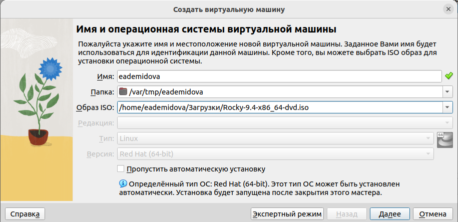
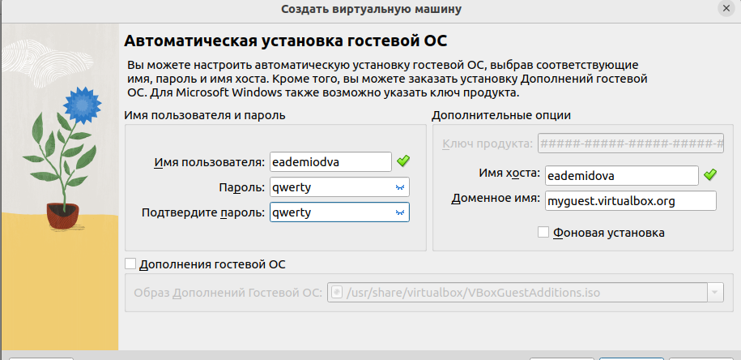
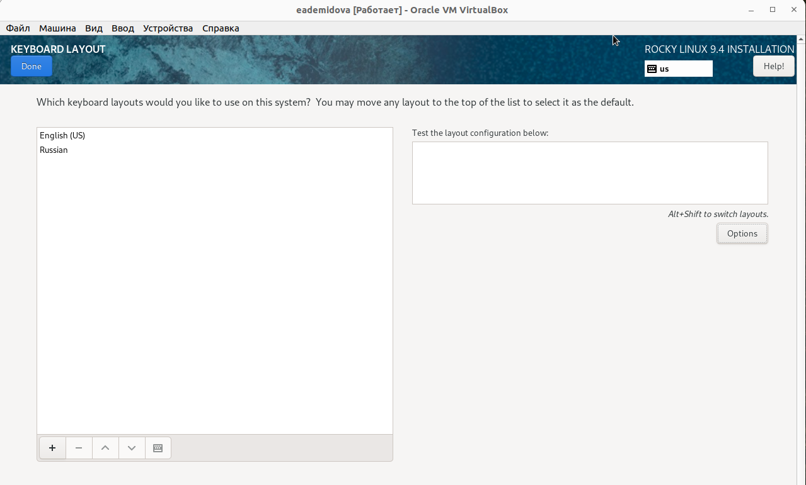
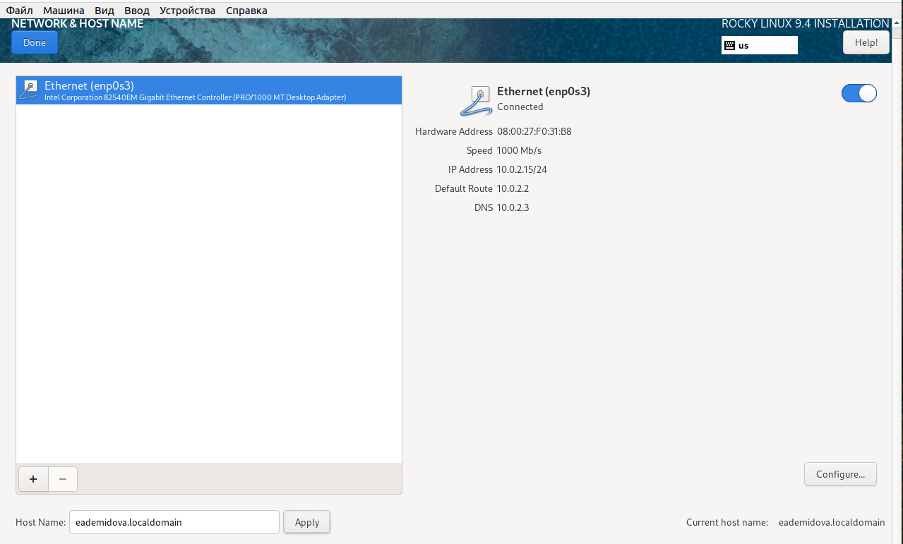
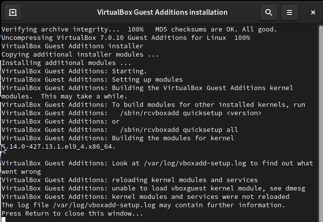
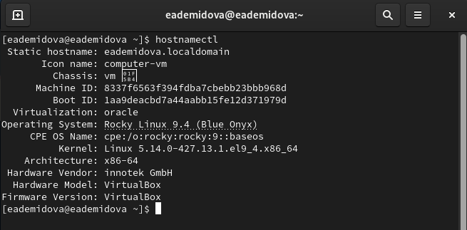
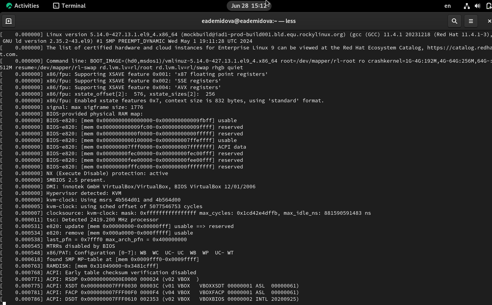

---
## Front matter
title: "Основы информационной безопасности"
subtitle: "Лабораторная работа № 1. Установка и конфигурация операционной системы на виртуальную машину"
author: "Демидова Екатерина Алексеевна"

## Generic otions
lang: ru-RU
toc-title: "Содержание"

## Bibliography
bibliography: bib/cite.bib
csl: pandoc/csl/gost-r-7-0-5-2008-numeric.csl

## Pdf output format
toc: true # Table of contents
toc-depth: 2
lof: true # List of figures
lot: false # List of tables
fontsize: 12pt
linestretch: 1.5
papersize: a4
documentclass: scrreprt
## I18n polyglossia
polyglossia-lang:
  name: russian
  options:
	- spelling=modern
	- babelshorthands=true
polyglossia-otherlangs:
  name: english
## I18n babel
babel-lang: russian
babel-otherlangs: english
## Fonts
mainfont: PT Serif
romanfont: PT Serif
sansfont: PT Sans
monofont: PT Mono
mainfontoptions: Ligatures=TeX
romanfontoptions: Ligatures=TeX
sansfontoptions: Ligatures=TeX,Scale=MatchLowercase
monofontoptions: Scale=MatchLowercase,Scale=0.9
## Biblatex
biblatex: true
biblio-style: "gost-numeric"
biblatexoptions:
  - parentracker=true
  - backend=biber
  - hyperref=auto
  - language=auto
  - autolang=other*
  - citestyle=gost-numeric
## Pandoc-crossref LaTeX customization
figureTitle: "Рис."
tableTitle: "Таблица"
listingTitle: "Листинг"
lofTitle: "Список иллюстраций"
lotTitle: "Список таблиц"
lolTitle: "Листинги"
## Misc options
indent: true
header-includes:
  - \usepackage{indentfirst}
  - \usepackage{float} # keep figures where there are in the text
  - \floatplacement{figure}{H} # keep figures where there are in the text
---

# Постановка задачи

Целью данной работы является приобретение практических навыков установки операционной системы на виртуальную машину, настройки минимально необходимых для дальнейшей работы сервисов.

# Выполнение лабораторной работы

Проверим в свойствах VirtualBox[@vb:bash] месторасположение каталога для виртуальных машин. Для этого в VirtualBox выберите Файл -> Настройки, вкладка Общие. В поле Папка для машин зададим /var/tmp/eademidova(рис. @fig:001)

{#fig:001 width=70%}

Скачаемаем образ Rocky Linux[@rocky:bash]. Создадим виртуальную машину. Добавим новый привод оптических дисков и выберите образ операционной системы, укажем имя виртуальной машины, тип операционной системы -- Linux, RedHat (64-bit), рамзер основной памяти  -- 2048 МБ,  конфигурацию жёсткого диска — загрузочный, VDI (BirtualBox Disk Image), динамический виртуальный диск,  размер диска — 40 ГБ (или больше), его расположение -- в данном случае /var/tmp/eademidova/eademidova.vd(рис. @fig:002 - @fig:005).

{#fig:002 width=70%}

{#fig:003 width=70%}

{#fig:004 width=70%}

{#fig:005 width=70%}

Запустим виртуальную машину, выберем English в качестве языка интерфейса, дополнительно добавим русский язык и установим комбинацию клавиш для смены раскладки(рис. @fig:006).

{#fig:006 width=70%}

В разделе выбора программ укажем в качестве базового окружения Server with GUI, а в качестве дополнения -- Development Tools (рис. @fig:007):

{#fig:007 width=70%}

Включим сетевое соединение и в качестве имени узла укажем eademidova.localdomain (рис. @fig:008):

{#fig:008 width=70%}

Установим пароль для root и пользователя с правами администратора(рис. @fig:009, @fig:010):

{#fig:009 width=70%}

{#fig:010 width=70%}

После завершения установки операционной системы корректно перезапустим виртуальную машину и при запросе примем условия лицензии. 

Войдем в ОС под заданной при установке учётной записью. В меню Устройства виртуальной машины подключим образ диска дополнений гостевой ОС, введем пароль пользователя root(рис. @fig:011):

{#fig:011 width=70%}

Проверим корректность имени хоста(рис. @fig:012):

{#fig:012 width=70%}

# Домашнее задание

В окне терминала проанализируем последовательность загрузки системы, выполнив команду dmesg (рис. @fig:013):

{#fig:013 width=70%}

Получим следующую информацию при помощи команды grep(рис. @fig:014):

1. Версия ядра Linux (Linux version).
2. Частота процессора (Detected Mhz processor).
3. Модель процессора (CPU0).
4. Объем доступной оперативной памяти (Memory available).
5. Тип обнаруженного гипервизора (Hypervisor detected).
6. Тип файловой системы корневого раздела.

{#fig:014 width=70%}

## Контрольные вопросы

1. Какую информацию содержит учётная запись пользователя?

Учётная запись пользователя содержит информацию, необходимую для идентификации и аутентификации пользователя при входе в систему. Она может включать следующую информацию:

- Имя пользователя (логин)
- Пароль
- Роль пользователя (например, администратор, обычный пользователь)
- Разрешения и права доступа пользователя к файлам и ресурсам системы
- Домашний каталог пользователя
- Информацию о группе, к которой принадлежит пользователь
- Дополнительные настройки и параметры учётной записи

2. Укажите команды терминала и приведите примеры:
- для получения справки по команде;
- для перемещения по файловой системе;
- для просмотра содержимого каталога;
- для определения объёма каталога;
- для создания / удаления каталогов / файлов;
- для задания определённых прав на файл / каталог;
- для просмотра истории команд.

- Для получения справки по команде используется команда man. Например, чтобы получить справку по команде ls, нужно выполнить man ls.
- Для перемещения по файловой системе используется команда cd. Например, чтобы перейти в домашний каталог пользователя, нужно выполнить cd ~.
- Для просмотра содержимого каталога используется команда ls. Например, чтобы просмотреть содержимое текущего каталога, нужно выполнить ls.
- Для определения объёма каталога можно использовать команду du. Например, чтобы узнать размер каталога /home/user, нужно выполнить du -sh /home/user.
- Для создания каталога используется команда mkdir. Например, чтобы создать каталог с именем new_directory, нужно выполнить mkdir new_directory.
- Для удаления каталога или файла используется команда rm. Например, чтобы удалить каталог directory, нужно выполнить rm -r directory.
- Для задания определённых прав на файл или каталог используется команда chmod. Например, чтобы задать права чтения, записи и выполнения для владельца файла file.txt, нужно выполнить chmod u+rwx file.txt.
- Для просмотра истории команд используется команда history. Например, чтобы просмотреть последние 10 выполненных команд, нужно выполнить history 10.

3. Что такое файловая система? Приведите примеры с краткой характери-
стикой.

Файловая система - это способ организации и хранения файлов на компьютере или другом устройстве. Она определяет структуру и формат файлов, а также правила доступа к ним. Файловая система позволяет пользователю организовывать файлы в каталоги и выполнять операции с ними, такие как чтение, запись и удаление. Примеры файловых систем:

- FAT32: это файловая система, которая широко используется на съемных носителях, таких как флеш-накопители и SD-карты. Она поддерживает файлы размером до 4 ГБ и имеет ограничения на длину имени файла и пути.
- NTFS: это файловая система, которая используется в операционных системах Windows. Она поддерживает большие файлы и имеет расширенные функции безопасности и управления правами доступа.
- ext4: это файловая система, которая широко используется в операционных системах Linux. Она обеспечивает высокую производительность и надежность, поддерживает большие файлы и имеет расширенные функции, такие как журналирование.
- APFS: это файловая система, разработанная Apple для операционных систем macOS, iOS, watchOS и tvOS. Она обеспечивает высокую производительность, эффективное использование пространства и надежность.

4. Как посмотреть, какие файловые системы подмонтированы в ОС?

Чтобы узнать, какие файловые системы подмонтированы в операционной системе, вы можете использовать команду `df`. Она позволяет отобразить информацию о доступном месте на файловых системах.

5. Как удалить зависший процесс?

Для удаления процесса с помощью команды `ps` надо найти PID процесса(`ps -ef | grep <название_процесса>`), а затем выполнить команду `kill <PID>`.

# Выводы

В результате выполнения работы были приобретены практические навыки установки операционной системы на виртуальную машину, настройки минимально необходимых для дальнейшей работы сервисов.

# Список литературы{.unnumbered}

::: {#refs}
:::

