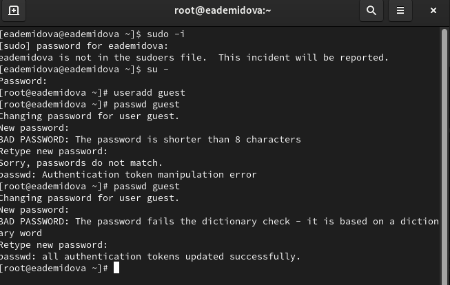
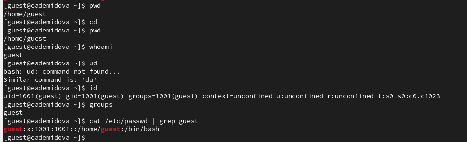
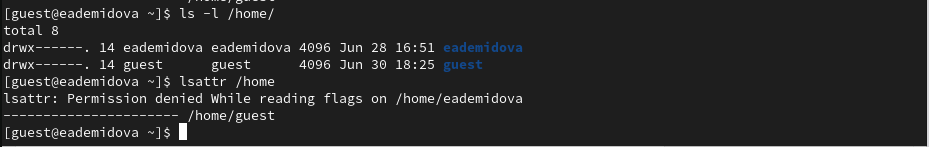
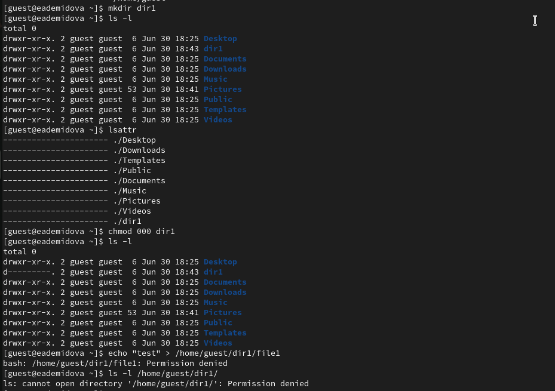

---
## Front matter
title: "Основы информационной безопасности"
subtitle: "Лабораторная работа № 2. Дискреционное разграничение прав в Linux. Основные атрибуты"
author: "Демидова Екатерина Алексеевна"

## Generic otions
lang: ru-RU
toc-title: "Содержание"

## Bibliography
bibliography: bib/cite.bib
csl: pandoc/csl/gost-r-7-0-5-2008-numeric.csl

## Pdf output format
toc: true # Table of contents
toc-depth: 2
lof: true # List of figures
lot: false # List of tables
fontsize: 12pt
linestretch: 1.5
papersize: a4
documentclass: scrreprt
## I18n polyglossia
polyglossia-lang:
  name: russian
  options:
	- spelling=modern
	- babelshorthands=true
polyglossia-otherlangs:
  name: english
## I18n babel
babel-lang: russian
babel-otherlangs: english
## Fonts
mainfont: PT Serif
romanfont: PT Serif
sansfont: PT Sans
monofont: PT Mono
mainfontoptions: Ligatures=TeX
romanfontoptions: Ligatures=TeX
sansfontoptions: Ligatures=TeX,Scale=MatchLowercase
monofontoptions: Scale=MatchLowercase,Scale=0.9
## Biblatex
biblatex: true
biblio-style: "gost-numeric"
biblatexoptions:
  - parentracker=true
  - backend=biber
  - hyperref=auto
  - language=auto
  - autolang=other*
  - citestyle=gost-numeric
## Pandoc-crossref LaTeX customization
figureTitle: "Рис."
tableTitle: "Таблица"
listingTitle: "Листинг"
lofTitle: "Список иллюстраций"
lotTitle: "Список таблиц"
lolTitle: "Листинги"
## Misc options
indent: true
header-includes:
  - \usepackage{indentfirst}
  - \usepackage{float} # keep figures where there are in the text
  - \floatplacement{figure}{H} # keep figures where there are in the text
---

# Цель работы

Получение практических навыков работы в консоли с атрибутами файлов, закрепление теоретических основ дискреционного разграничения доступа в современных системах с открытым кодом на базе ОС Linux.

# Теоретические сведения

При работе с командой chmod важно понимать основные права доступа, которые назначают файлам или каталогам. В Linux используется три основных типа прав доступа[@scott_linux_2019]:

  - Чтение (Read) — обозначается буквой «r». Предоставляет возможность просматривать содержимое файла или каталога.
  - Запись (Write) — обозначается буквой «w». Позволяет создавать, изменять и удалять файлы внутри каталога, а также изменять содержимое файла.
  - Выполнение (Execute) — обозначается буквой «x». Дает разрешение на выполнение файла или на вход в каталог.

Каждый из указанных выше типов прав доступа может быть назначен трем группам пользователей:

  - Владелец (Owner) — пользователь, который является владельцем файла или каталога.
  - Группа (Group) — группа пользователей, к которой принадлежит файл или каталог.
  - Остальные пользователи (Others) — все остальные пользователи системы.

Комбинация этих базовых прав доступа для каждой из групп пользователей определяет полный набор прав доступа для файла или каталога.

# Выполнение лабораторной работы

В установленной при выполнении предыдущей лабораторной работы ОС создадим учетную запись ползователя guest(рис. @fig:001)

{#fig:001 width=70%}

Войдем в систему от имени пользователя guest. Определим директорию, в которой мы находимся, командой `pwd`. Сравнив её с приглашением командной строки, увидим, что она называется как наш пользователь. Она является домашней директорией. Также уточним им нашего пользователя командой `whoami`. С помощью команды id также увидим имя пользователя и его id 1001, а кроме того, что он входит в группу guest с id 1001. Сравнивая вывод id с выводом команды groups, можно увидеть, что действительно наш пользователь входит только в одну группу(в этом случае указывается только ее название). Посмотрим файл /etc/passwd командой `cat /etc/passwd` и увидим, что uid и gid пользователя равен 1001, что также было видно из предыдщих выводов команд(рис. @fig:002).

{#fig:002 width=70%}

Определим существующие в системе директории командой `ls -l /home/` -- это guest и eademidova, правами на чтение, запись и изменение директорий владеет только их владелец. Также с помощью команды lsattr увидим, что для нашей домашней директории не установлены расширенные атрибуты, а для других пользователей мы не можем это увидеть(рис. @fig:003)

{#fig:003 width=70%}

Создадим в домашней директории поддиректорию dir1 командой `mkdir dir1`, с помощью команд `ls -l` и `lsattr` увидим, что для владельца этой директории есть все права, а для группы и остальных доступно только чтение и вход(не доступно внесение изменений), также видно, что никаких расщиренных атрибутов не установлено.
Затем снимем с директории dir1 все атрибуты командой `chmod 000 dir1` и проверим выполнение с помощью команды `ls -l`. Также попытаемся создать в директории dir1 файл file1 командой `echo "test" > /home/guest/dir1/file1`, но так как мы забрали право на запись в эту директорию, то получим отказ в создании. А введя команду `ls -l /home/guest/dir1` увидим, что просмотр директории также запрещен(рис. @fig:004).

{#fig:004 width=70%}

В табл. [-@tbl:tbl1] приведены данные о том, какие операции разрешены, а какие нет для владельца данных.

: Установленные права и разрешённые действия {#tbl:tbl1}

| Права директории | Права файла | Создание файла | Удаление файла | Запись в файл | Чтение файла | Смена директории | Просмотр файлов в директории | Переименование файла | Смена атрибутов файла |
|----------------------|-----------|--------|--------|--------|--------|--------|--------|--------|--------|
|   d(000)   |   (000)   |    -    |    -    |    -    |    -    |    -    |    -    |    -    |    -    |
|   d(100)   |   (000)   |    -    |    -    |    -    |    -    |    +    |    -    |    -    |    +    |
|   d(200)   |   (000)   |    -    |    -    |    -    |    -    |    -    |    -    |    -    |    -    |
|   d(300)   |   (000)   |    +    |    +    |    -    |    -    |    +    |    -    |    +    |    +    |
|   d(400)   |   (000)   |    -    |    -    |    -    |    -    |    -    |    +    |    -    |    -    |
|   d(500)   |   (000)   |    -    |    -    |    -    |    -    |    +    |    +    |    -    |    +    |
|   d(600)   |   (000)   |    -    |    -    |    -    |    -    |    -    |    +    |    -    |    -    |
|   d(700)   |   (000)   |    +    |    +    |    -    |    -    |    +    |    +    |    +    |    +    |
|   d(000)   |   (100)   |    -    |    -    |    -    |    -    |    -    |    -    |    -    |    -    |
|   d(100)   |   (100)   |    -    |    -    |    -    |    -    |    +    |    -    |    -    |    +    |
|   d(200)   |   (100)   |    -    |    -    |    -    |    -    |    -    |    -    |    -    |    -    |
|   d(300)   |   (100)   |    +    |    +    |    -    |    -    |    +    |    -    |    +    |    +    |
|   d(400)   |   (100)   |    -    |    -    |    -    |    -    |    -    |    +    |    -    |    -    |
|   d(500)   |   (100)   |    -    |    -    |    -    |    -    |    +    |    +    |    -    |    +    |
|   d(600)   |   (100)   |    -    |    -    |    -    |    -    |    -    |    +    |    -    |    -    |
|   d(700)   |   (100)   |    +    |    +    |    -    |    -    |    +    |    +    |    +    |    +    |
|   d(000)   |   (200)   |    -    |    -    |    -    |    -    |    -    |    -    |    -    |    -    |
|   d(100)   |   (200)   |    -    |    -    |    +    |    -    |    +    |    -    |    -    |    +    |
|   d(200)   |   (200)   |    -    |    -    |    -    |    -    |    -    |    -    |    -    |    -    |
|   d(300)   |   (200)   |    +    |    +    |    +    |    -    |    +    |    -    |    +    |    +    |
|   d(400)   |   (200)   |    -    |    -    |    -    |    -    |    -    |    +    |    -    |    -    |
|   d(500)   |   (200)   |    -    |    -    |    +    |    -    |    +    |    +    |    -    |    +    |
|   d(600)   |   (200)   |    -    |    -    |    -    |    -    |    -    |    +    |    -    |    -    |
|   d(700)   |   (200)   |    +    |    +    |    +    |    -    |    +    |    +    |    +    |    +    |
|   d(000)   |   (300)   |    -    |    -    |    -    |    -    |    -    |    -    |    -    |    -    |
|   d(100)   |   (300)   |    -    |    -    |    +    |    -    |    +    |    -    |    -    |    +    |
|   d(200)   |   (300)   |    -    |    -    |    -    |    -    |    -    |    -    |    -    |    -    |
|   d(300)   |   (300)   |    +    |    +    |    +    |    -    |    +    |    -    |    +    |    +    |
|   d(400)   |   (300)   |    -    |    -    |    -    |    -    |    -    |    +    |    -    |    -    |
|   d(500)   |   (300)   |    -    |    -    |    +    |    -    |    +    |    +    |    -    |    +    |
|   d(600)   |   (300)   |    -    |    -    |    -    |    -    |    -    |    +    |    -    |    -    |
|   d(700)   |   (300)   |    +    |    +    |    +    |    -    |    +    |    +    |    +    |    +    |
|   d(000)   |   (400)   |    -    |    -    |    -    |    -    |    -    |    -    |    -    |    -    |
|   d(100)   |   (400)   |    -    |    -    |    -    |    +    |    +    |    -    |    -    |    +    |
|   d(200)   |   (400)   |    -    |    -    |    -    |    -    |    -    |    -    |    -    |    -    |
|   d(300)   |   (400)   |    +    |    +    |    -    |    +    |    +    |    -    |    +    |    +    |
|   d(400)   |   (400)   |    -    |    -    |    -    |    -    |    -    |    +    |    -    |    -    |
|   d(500)   |   (400)   |    -    |    -    |    -    |    +    |    +    |    +    |    -    |    +    |
|   d(600)   |   (400)   |    -    |    -    |    -    |    -    |    -    |    +    |    -    |    -    |
|   d(700)   |   (400)   |    +    |    +    |    -    |    +    |    +    |    +    |    +    |    +    |
|   d(000)   |   (500)   |    -    |    -    |    -    |    -    |    -    |    -    |    -    |    -    |
|   d(100)   |   (500)   |    -    |    -    |    -    |    +    |    +    |    -    |    -    |    +    |
|   d(200)   |   (500)   |    -    |    -    |    -    |    -    |    -    |    -    |    -    |    -    |
|   d(300)   |   (500)   |    +    |    +    |    -    |    +    |    +    |    -    |    +    |    +    |
|   d(400)   |   (500)   |    -    |    -    |    -    |    -    |    -    |    +    |    -    |    -    |
|   d(500)   |   (500)   |    -    |    -    |    -    |    +    |    +    |    +    |    -    |    +    |
|   d(600)   |   (500)   |    -    |    -    |    -    |    -    |    -    |    +    |    -    |    -    |
|   d(700)   |   (500)   |    +    |    +    |    -    |    +    |    +    |    +    |    +    |    +    |
|   d(000)   |   (600)   |    -    |    -    |    -    |    -    |    -    |    -    |    -    |    -    |
|   d(100)   |   (600)   |    -    |    -    |    +    |    +    |    +    |    -    |    -    |    +    |
|   d(200)   |   (600)   |    -    |    -    |    -    |    -    |    -    |    -    |    -    |    -    |
|   d(300)   |   (600)   |    +    |    +    |    +    |    +    |    +    |    -    |    +    |    +    |
|   d(400)   |   (600)   |    -    |    -    |    -    |    -    |    -    |    +    |    -    |    -    |
|   d(500)   |   (600)   |    -    |    -    |    +    |    +    |    +    |    +    |    -    |    +    |
|   d(600)   |   (600)   |    -    |    -    |    -    |    -    |    -    |    +    |    -    |    -    |
|   d(700)   |   (600)   |    +    |    +    |    +    |    +    |    +    |    +    |    +    |    +    |
|   d(000)   |   (700)   |    -    |    -    |    -    |    -    |    -    |    -    |    -    |    -    |
|   d(100)   |   (700)   |    -    |    -    |    +    |    +    |    +    |    -    |    -    |    +    |
|   d(200)   |   (700)   |    -    |    -    |    -    |    -    |    -    |    -    |    -    |    -    |
|   d(300)   |   (700)   |    +    |    +    |    +    |    +    |    +    |    -    |    +    |    +    |
|   d(400)   |   (700)   |    -    |    -    |    -    |    -    |    -    |    +    |    -    |    -    |
|   d(500)   |   (700)   |    -    |    -    |    +    |    +    |    +    |    +    |    -    |    +    |
|   d(600)   |   (700)   |    -    |    -    |    -    |    -    |    -    |    +    |    -    |    -    |
|   d(700)   |   (700)   |    +    |    +    |    +    |    +    |    +    |    +    |    +    |    +    |

В табл. [-@tbl:tbl2] приведены данные о том, какие минимальные права должны быть для совершения различных действий.

: Минимальные права для совершения операций {#tbl:tbl2}

| Операция | Минимальные права на директорию | Минимальные права на файл |
|----------|---------------------------------|---------------------------|
|Создание файла|            d(300)               |               (000)            |
|Удаление файла|            d(300)               |               (000)            |
|Чтение файла|            d(100)               |               (400)            |
|Запись в файл|            d(100)               |               (200)            |
|Переименование файла |            d(300)               |               (000)            |
|Создание поддиректории |            d(300)               |               (000)            |
|Удаление поддиректории |            d(300)               |               (000)            |

# Выводы

В результате выполнения работы были приобретены практические навыки работы в консоли с атрибутами файлов, закрепление теоретических основ дискреционного разграничения доступа в современных системах с открытым кодом на базе ОС Linux.

# Список литературы{.unnumbered}

::: {#refs}
:::

