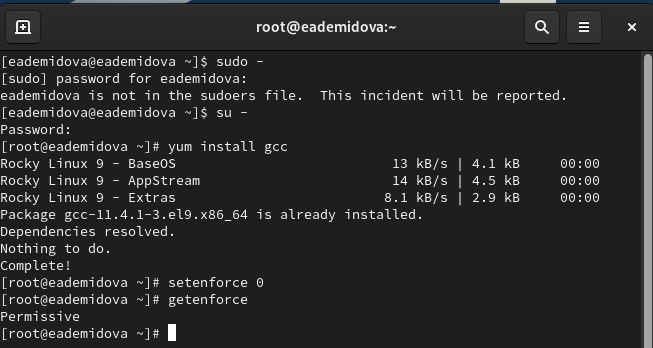
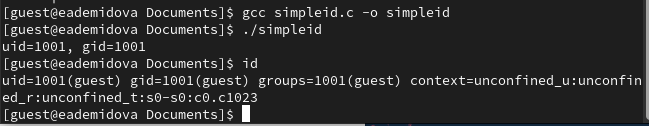
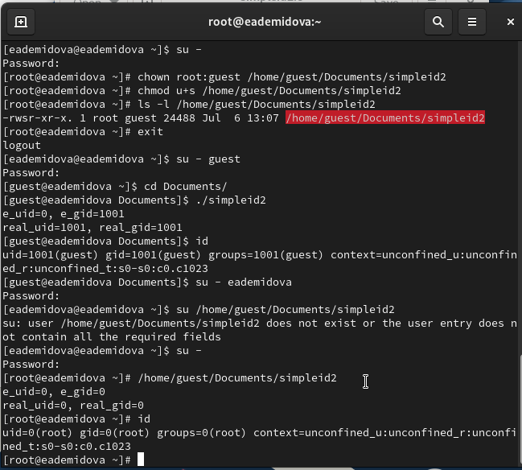
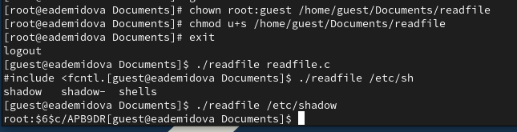
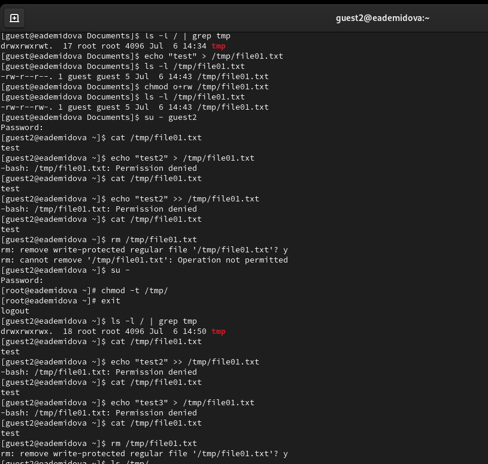

---
## Front matter
lang: ru-RU
title:  Основы информационной безопасности. Лабораторная работа № 5
subtitle: Дискреционное разграничение прав в Linux. Исследование влияния дополнительных атрибутов
author: |
	Демидова Е.А.
institute: Российский Университет дружбы народов
date: 09.09.2023

## i18n babel
babel-lang: russian
babel-otherlangs: english

## Formatting pdf
toc: false
toc-title: Содержание
slide_level: 2
aspectratio: 169
section-titles: true
theme: metropolis
header-includes:
 - \metroset{progressbar=frametitle,sectionpage=progressbar,numbering=fraction}
 - '\makeatletter'
 - '\beamer@ignorenonframefalse'
 - '\makeatother'
---

# Информация

## Докладчик

:::::::::::::: {.columns align=center}
::: {.column width="70%"}

  * Демидова Екатерина Алексеевна
  * студентка группы НКНбд-01-21
  * Российский университет дружбы народов
  * <https://github.com/eademidova>

:::
::: {.column width="30%"}

:::
::::::::::::::

# Вводная часть

## Цели и задачи

**Целью** данной работы является изучение механизмов изменения идентификаторов, применения SetUID- и Sticky-битов. Получение практических навыков работы в консоли с дополнительными атрибутами. Рассмотрение работы механизма смены идентификатора процессов пользователей, а также влияние бита Sticky на запись и удаление файлов.

**Задачи:**

- Изменение идентификаторов и применение SetUID- и Sticky-битов
- Проверка прав дсотупа при разных дополнительных атрибутах

**Инструмент:** VirtualBox, bash

# Выполнение лабораторной работы

## Подготовка лабораторного стенда

{#fig:001 width=70%}

## Текст программы

{#fig:002 width=70%}

## Запуск программы

{#fig:003 width=70%}

## Текст программы

{#fig:004 width=70%}

## Запуск программы

{#fig:005 width=70%}

## Изменение и проверка прав доступа

{#fig:006 width=50%}

## Изменение и проверка прав доступа

{#fig:007 width=70%}

## Текст программы

{#fig:008 width=70%}

## Изменение и проверка прав доступа

{#fig:009 width=50%}

## Изменение и проверка прав доступа

{#fig:010 width=70%}

## Изменение и проверка прав доступа

{#fig:011 width=50%}

# Заключение

## Выводы

В результате выполнения работы были выполнены:

- Изучение механизмов изменения идентификаторов, применения SetUID- и Sticky-битов.
- Получение практических навыков работы в консоли с дополнительными атрибутами.
- Рассмотрение работы механизма смены идентификатора процессов пользователей, а также влияние бита Sticky на запись и удаление файлов.

## Список литературы

1. Граннеман С. Скотт Граннеман: Linux. Карманный справочник. 2-е изд. Вильямс, 2019. 464 с.
