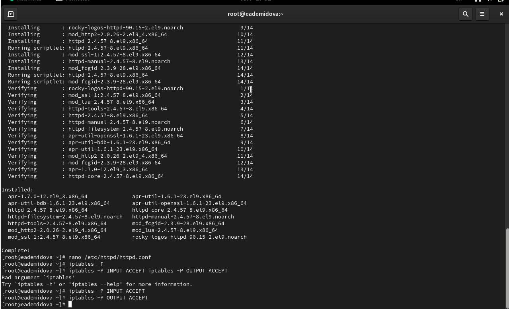
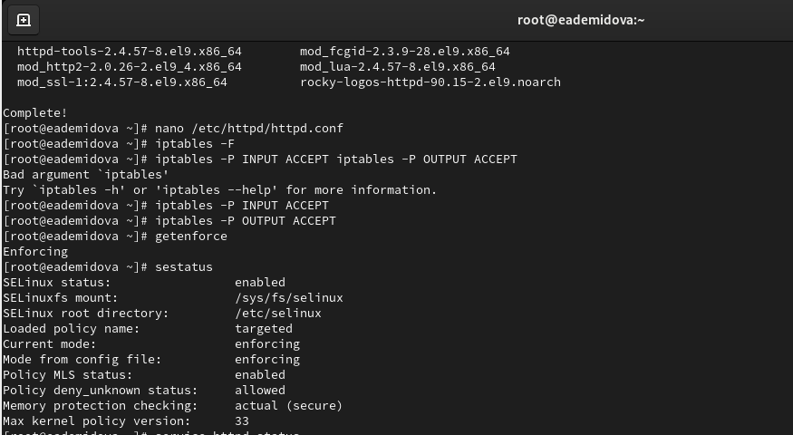
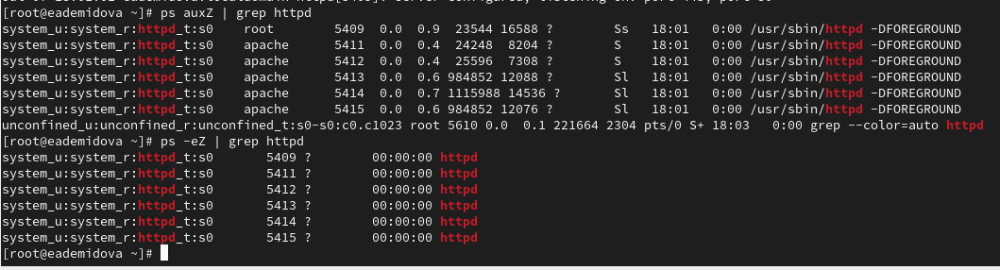
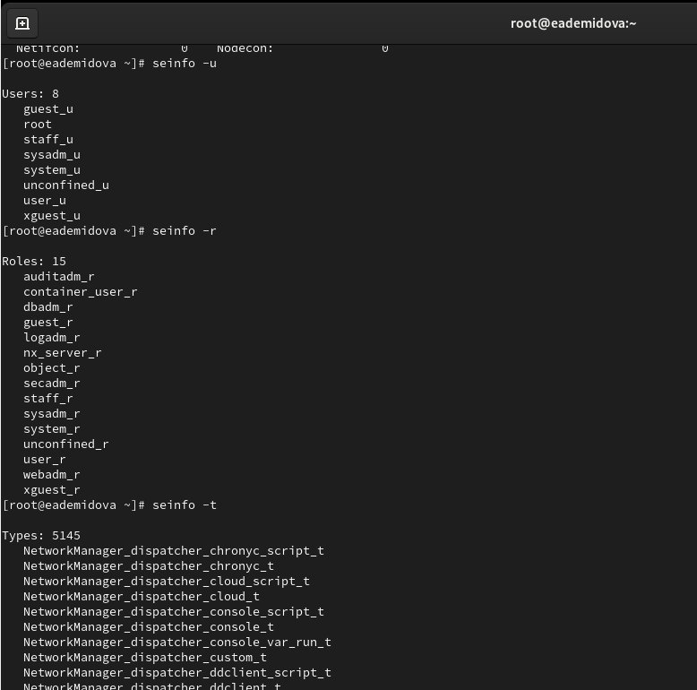
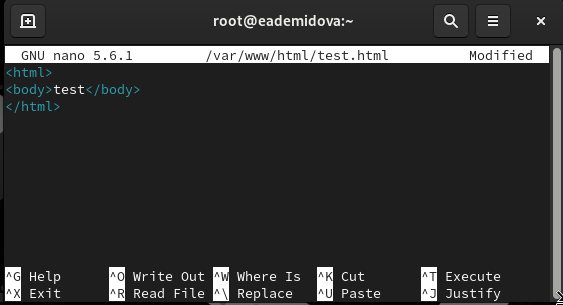
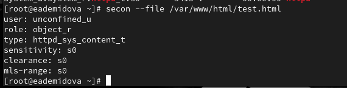
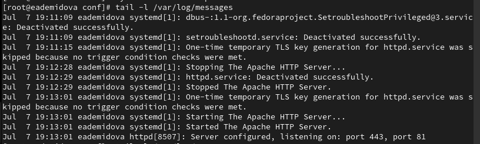
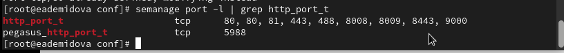

---
## Front matter
lang: ru-RU
title:  Основы информационной безопасности. Лабораторная работа №6
subtitle: Мандатное разграничение прав в Linux
author: |
	Демидова Е.А.
institute: Российский Университет дружбы народов
date: 09.09.2023

## i18n babel
babel-lang: russian
babel-otherlangs: english

## Formatting pdf
toc: false
toc-title: Содержание
slide_level: 2
aspectratio: 169
section-titles: true
theme: metropolis
header-includes:
 - \metroset{progressbar=frametitle,sectionpage=progressbar,numbering=fraction}
 - '\makeatletter'
 - '\beamer@ignorenonframefalse'
 - '\makeatother'
---

# Информация

## Докладчик

:::::::::::::: {.columns align=center}
::: {.column width="70%"}

  * Демидова Екатерина Алексеевна
  * студентка группы НКНбд-01-21
  * Российский университет дружбы народов
  * <https://github.com/eademidova>

:::
::: {.column width="30%"}

:::
::::::::::::::

# Вводная часть

## Цели и задачи

**Целью** данной работы является приобретение практических навыков администрирования ОС Linux.

**Задачи:**

- Получить первое практическое знакомство с технологией SELinux.
- Проверить работу SELinx на практике совместно с веб-сервером Apache.

**Инструмент:** VirtualBox

# Выполнение лабораторной работы

## Подготовка лабораторного стенда

{#fig:001 width=70%}

## Практическое знакомтсво с технологией SELinux

{#fig:002 width=70%}

## Практическое знакомтсво с технологией SELinux

{#fig:003 width=70%}

## Практическое знакомтсво с технологией SELinux

{#fig:004 width=70%}

## Практическое знакомтсво с технологией SELinux

{#fig:005 width=50%}

## Практическое знакомтсво с технологией SELinux

{#fig:006 width=50%}

## Практическое знакомтсво с технологией SELinux

{#fig:007 width=50%}

## Практическое знакомтсво с технологией SELinux

{#fig:008 width=70%}

## Практическое знакомтсво с технологией SELinux

{#fig:009 width=70%}

## Практическое знакомтсво с технологией SELinux

{#fig:010 width=70%}

## Практическое знакомтсво с технологией SELinux

{#fig:011 width=70%}

## Практическое знакомтсво с технологией SELinux

{#fig:012 width=70%}

## Практическое знакомтсво с технологией SELinux

{#fig:013 width=70%}

## Практическое знакомтсво с технологией SELinux

{#fig:014 width=70%}

## Практическое знакомтсво с технологией SELinux

{#fig:015 width=70%}

## Практическое знакомтсво с технологией SELinux

{#fig:016 width=70%}

## Практическое знакомтсво с технологией SELinux

{#fig:017 width=70%}

## Практическое знакомтсво с технологией SELinux

{#fig:0148 width=70%}

# Заключение

## Выводы

В результате выполнения работы были приобретены практические навыки администрирования ОС Linux. Получено первое практическое знакомство с технологией SELinux. Проверена работа SELinx на практике совместно с веб-сервером Apache.

## Список литературы

SELinux – описание и особенности работы с системой. Часть 1 [Электронный ресурс]. Habr, 2014. URL: https://habr.com/ru/companies/kingservers/articles/209644/.
