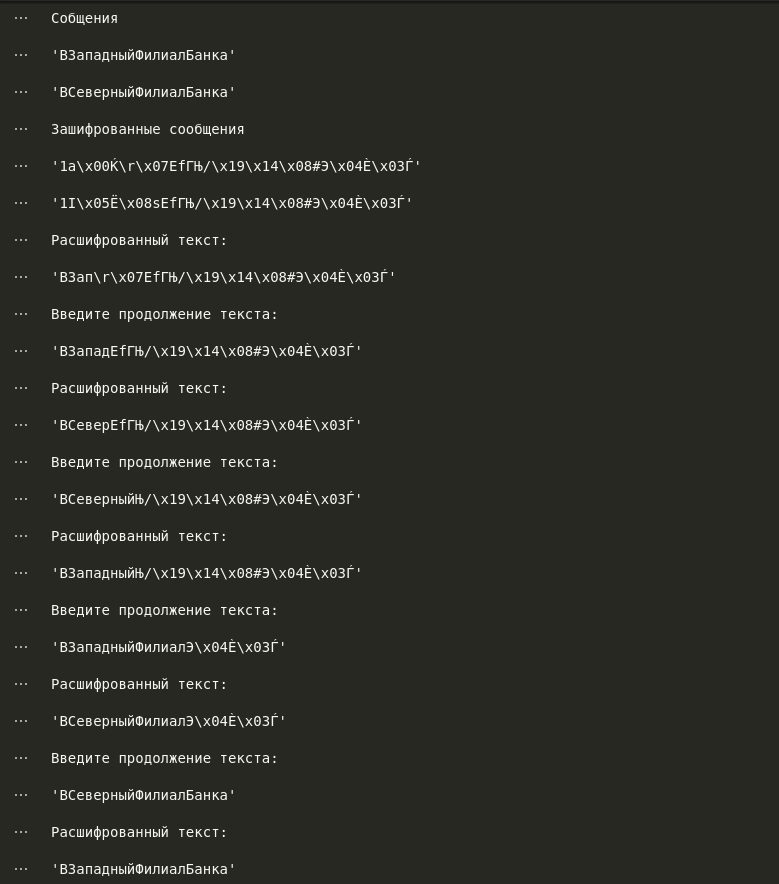

---
## Front matter
title: "Основы информационной безопасности"
subtitle: "Элементы криптографии. Шифрование (кодирование) различных исходных текстов одним ключом"
author: "Демидова Екатерина Алексеевна"

## Generic otions
lang: ru-RU
toc-title: "Содержание"

## Bibliography
bibliography: bib/cite.bib
csl: pandoc/csl/gost-r-7-0-5-2008-numeric.csl

## Pdf output format
toc: true # Table of contents
toc-depth: 2
lof: true # List of figures
lot: false # List of tables
fontsize: 12pt
linestretch: 1.5
papersize: a4
documentclass: scrreprt
## I18n polyglossia
polyglossia-lang:
  name: russian
  options:
	- spelling=modern
	- babelshorthands=true
polyglossia-otherlangs:
  name: english
## I18n babel
babel-lang: russian
babel-otherlangs: english
## Fonts
mainfont: PT Serif
romanfont: PT Serif
sansfont: PT Sans
monofont: PT Mono
mainfontoptions: Ligatures=TeX
romanfontoptions: Ligatures=TeX
sansfontoptions: Ligatures=TeX,Scale=MatchLowercase
monofontoptions: Scale=MatchLowercase,Scale=0.9
## Biblatex
biblatex: true
biblio-style: "gost-numeric"
biblatexoptions:
  - parentracker=true
  - backend=biber
  - hyperref=auto
  - language=auto
  - autolang=other*
  - citestyle=gost-numeric
## Pandoc-crossref LaTeX customization
figureTitle: "Рис."
tableTitle: "Таблица"
listingTitle: "Листинг"
lofTitle: "Список иллюстраций"
lotTitle: "Список таблиц"
lolTitle: "Листинги"
## Misc options
indent: true
header-includes:
  - \usepackage{indentfirst}
  - \usepackage{float} # keep figures where there are in the text
  - \floatplacement{figure}{H} # keep figures where there are in the text
---

# Цель работы

Освоить на практике применение режима однократного гаммирования на примере кодирования различных исходных текстов одним ключом

# Задание

Два текста кодируются одним ключом (однократное гаммирование). Требуется не зная ключа и не стремясь его определить, прочитать оба текста. Необходимо разработать приложение, позволяющее шифровать и дешифровать тексты P1 и P2 в режиме однократного гаммирования. Приложение должно определить вид шифротекстов C1 и C2 обоих текстов P1 и P2 при известном ключе ; Необходимо определить и выразить аналитически способ, при котором злоумышленник может прочитать оба текста, не зная ключа и не стремясь его определить.

# Теоретические сведения

Гаммиирование, или Шифр XOR, — метод симметричного шифрования, заключающийся в «наложении» последовательности, состоящей из случайных чисел, на открытый текст[@intro_crypto_2017]:. Последовательность случайных чисел называется гамма-последовательностью и используется для зашифровывания и расшифровывания данных. 

# Выполнение лабораторной работы

Создадим функции: `key_gen` -- отвечает за генерацию случайного ключа(составляется выбором из букв кириллицы больших и малых, символов, цифр), `encryption` -- принимает на вход текст и ключ, а затем осуществляет посимвольное сложение по модулю 2:

```py
def key_gen(text):
    alph = [chr(i) for i in range(1040,1104)] + [chr(i) for i in range(33,64)]
    key = "".join([random.choice(alph) for i in range(len(text))])
    return key

def encryption(text, key):
    return "".join([chr(ord(key[i])^ord(text[i])) for i in range(len(key))])
```

Сначала зашифруем два сообщения:
```py
P1 = "ВЗападныйФилиалБанка"
P2 = "ВСеверныйФилиалБанка"
key = key_gen(P1)
C1 = encryption(P1, key)
C2 = encryption(P2, key)
```

Опишем случай, когда злоумышленник может прочитать оба текста, не зная ключа и не стремясь его определить. Предположим, что одна из телеграмм является шаблоном -- т.е. имеет текст фиксированный формат, в который вписываются значения полей. Допустим, что злоумышленнику этот формат известен. Тогда он получает достаточно много пар $C1 \oplus C2$ (известен вид обеих шифровок). Тогда зная P1 имеем:

$$
C1 \oplus C2 \oplus P1 = P1 \oplus P2 \oplus P1 = P2. 
$$

Проиллюстрируем этот процесс на практике.
Применим наши функции к заданному сообщению. Допустим нам известна часть второго сообщения. В цикле `while` в интерактивном режиме будет отгадывать части сообщений, пока не угадаем их полностью:

```py
fragment = "ВСев"

msg2 = fragment
c1, c2 = C1, C2
length = len(msg2)
while length <= len(P1):
    C12 = encryption(C1[:length], C2[:length])
    msg1 = encryption(C12, msg2) 
    print("Расшифрованный текст:")
    display(msg1 + c1[length:])
    print("Введите продолжение текста: ")
    msg1 += input()
    length = len(msg1)
    display(msg1 + c1[length:])
    
    msg1, msg2 = msg2, msg1
    c1, c2 = c2, c1
```

В результате получим(рис. @fig:001)

{#fig:001 width=70%}

# Контрольные вопросы

1. Как, зная один из текстов (P1 или P2), определить другой, не зная при этом ключа?

Предположим, что одна из телеграмм является шаблоном -- т.е. имеет текст фиксированный формат, в который вписываются значения полей. Допустим, что злоумышленнику этот формат известен. Тогда он получает достаточно много пар $C1 \oplus C2$ (известен вид обеих шифровок). Тогда зная P1 имеем:

$$
C1 \oplus C2 \oplus P1 = P1 \oplus P2 \oplus P1 = P2. 
$$

2. Что будет при повторном использовании ключа при шифровании текста?

Текст вернется к исходному виду.

3. Как реализуется режим шифрования однократного гаммирования одним ключом двух открытых текстов?

К обоим текстам применяется один и тот же ключ.

4. Перечислите недостатки шифрования одним ключом двух открытых
текстов.

Главным недостатком является повышение уязвимости. Если злоумышленник узнает один из исзодных текстов или даже его часть, то он может узнать и второй текст.

5. Перечислите преимущества шифрования одним ключом двух открытых
текстов.

Ключи могут занимать большое количество памяти и долго генерироваться, поэтому использование одного ключа оптимизирует шифрование. Также это упрощает дешифровку.

# Выводы

В результате выполнения работы были освоены практические навыки применения режима однократного гаммирования на примере кодирования различных исходных текстов одним ключом

# Список литературы{.unnumbered}

::: {#refs}
:::


