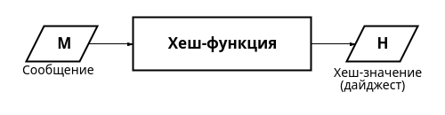

---
## Front matter
lang: ru-RU
title: Доклад
subtitle: Хеш-функции
author:
  - Демидова Е. А.
institute:
  - Российский университет дружбы народов, Москва, Россия
date: 17 октября 2024

## i18n babel
babel-lang: russian
babel-otherlangs: english

## Formatting pdf
toc: false
toc-title: Содержание
slide_level: 2
aspectratio: 169
section-titles: true
theme: metropolis
header-includes:
 - \metroset{progressbar=frametitle,sectionpage=progressbar,numbering=fraction}
 - '\makeatletter'
 - '\beamer@ignorenonframefalse'
 - '\makeatother'
---

# Информация

## Докладчик

:::::::::::::: {.columns align=center}
::: {.column width="70%"}

  * Демидова Екатерина Алексеевна
  * студентка группы НКНбд-01-21
  * Российский университет дружбы народов
  * <https://github.com/eademidova>

:::
::: {.column width="30%"}

:::
::::::::::::::

# Введение

**Цель работы**

Изучить понятие криптографической хеш-функции и основные алгоритмы её построения.

**Задачи**

- Дать определение криптографической хеш-функции.
- Описать построение хеш-функции на основе сжатия и на основе перестановок.
- Привести сведения об основных хеш-функциях.

# Общие сведения о хеш-функциях

## Определение хеш-функции

{#fig:001 width=80%}

## Требования к криптографическим хеш-функциям

1. Стойкость к восстановлению прообраза.

$$h = hash(m)$$,
$h$ -- хеш, $m$ -- сообщение(первый прообраз).

2. Стойкость к восстановлению второго прообраза.

$$hash(m_{1})=hash(m_{2})$$

$m_1$, $m_2$ -- сообщения ($m_1 \neq m_2$).

3. Стойкость к коллизиям.

4. Псевдослучайность.
   
5. Лавинный эффект

# Построение функций хеширования

## Подходы к построению функций хеширования

- итеративное хеширование с помощью функции сжатия(построение Меркла–Дамгора)
- итеративное хеширование с помощью функции губки

## Хеш-функции на основе сжатия: построение Меркла–Дамгора

{#fig:002 width=70%}

Пусть длина сообщения 8 бит, хеш-функция работает с блоками длины 512 бит. Тогда блок будет выглядеть следующим образом:

$$101010101000000000000000 (\dots) 0000000000001000$$

## Создание функций сжатия: построение Дэвиса–Мейера

{#fig:003 width=40%}

$$H_i = E(M_i, H_{i-1}) \oplus H_{i-1},$$

$M_i$ -- блок сообщения, $H_{i}$ -- цепное значение, $E$ -- блочный шифр.

## Хеш-функции на основе перестановок: функции губки

{#fig:004 width=75%}

## Семействa функций

- MD-5 -- 128-битное хеш-значение
- SHA-1 -- 160-битное хеш-значение
- SHA-2 -- наиболее использумый SHA-256(256-битное хеш-значение)
- SHA-3 -- в отличие от предшественников использует функцию-губки
- Стрибог -- 128-битное или 256-битное хеш-значение

## Применения

  - Цифровые подписи
  - Проверка целостности файла
  - Безопасность паролей
  - Технология Blockchain
  - SSL /TLS протоколы

# Выводы

В результате работы было дано определение криптографической хеш-функции, описано её построение на основе сжатия(построения Меркла-Дамгора) и на основе перестановок(функции губки). А также рассмотрены основные хеш-функции из семейства MD, SHA и Стрибог.

## Список литературы

1. Шнайер Б. Прикладная криптография. Протоколы, алгоритмы, исходные тексты на языке Си. 4-е изд. М.: Триумф, 2021. 328 с.
2. Омассон Ж.-Ф. О криптографии всерьез / пер. с англ. А. А. Слинкина. 4-е изд. М.: ДМК Пресс, 2021. 328 с.
3. FIPS PUB 180-4 – редакция Secure Hash Standard от августа 2015 года [Электронный ресурс]. URL: https://web.archive.org/web/20161126003357/http://nvlpubs.nist.gov/nistpubs/FIPS/NIST.FIPS.180-4.pdf.
4. ГОСТ 34.11-2018 «Информационная технология. Криптографическая защита информации. Функция хэширования».