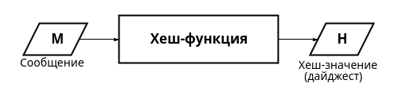
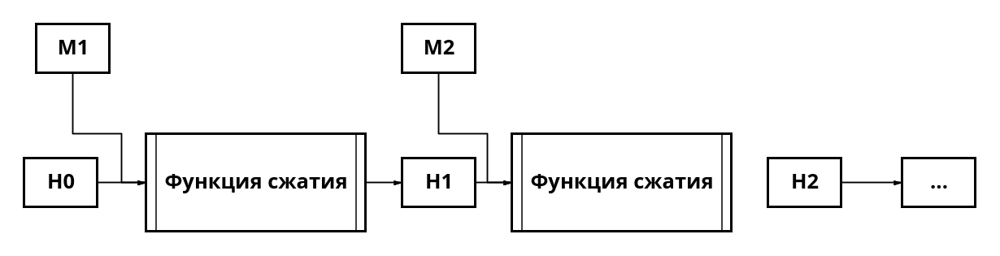
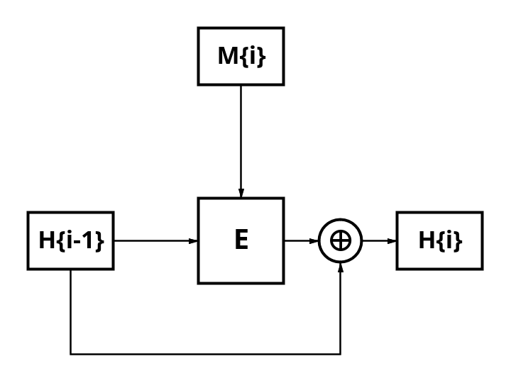
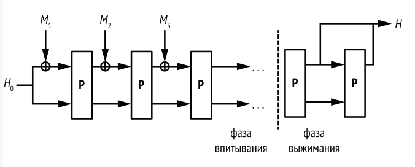

---
## Front matter
title: "Доклад"
subtitle: "Хеш-функции"
author: "Демидова Екатерина Алексеевна"

## Generic otions
lang: ru-RU
toc-title: "Содержание"

## Bibliography
bibliography: bib/cite.bib
csl: pandoc/csl/gost-r-7-0-5-2008-numeric.csl

## Pdf output format
toc: true # Table of contents
toc-depth: 2
lof: true # List of figures
lot: false # List of tables
fontsize: 12pt
linestretch: 1.5
papersize: a4
documentclass: scrreprt
## I18n polyglossia
polyglossia-lang:
  name: russian
  options:
	- spelling=modern
	- babelshorthands=true
polyglossia-otherlangs:
  name: english
## I18n babel
babel-lang: russian
babel-otherlangs: english
## Fonts
mainfont: PT Serif
romanfont: PT Serif
sansfont: PT Sans
monofont: PT Mono
mainfontoptions: Ligatures=TeX
romanfontoptions: Ligatures=TeX
sansfontoptions: Ligatures=TeX,Scale=MatchLowercase
monofontoptions: Scale=MatchLowercase,Scale=0.9
## Biblatex
biblatex: true
biblio-style: "gost-numeric"
biblatexoptions:
  - parentracker=true
  - backend=biber
  - hyperref=auto
  - language=auto
  - autolang=other*
  - citestyle=gost-numeric
## Pandoc-crossref LaTeX customization
figureTitle: "Рис."
tableTitle: "Таблица"
listingTitle: "Листинг"
lofTitle: "Список иллюстраций"
lotTitle: "Список таблиц"
lolTitle: "Листинги"
## Misc options
indent: true
header-includes:
  - \usepackage{indentfirst}
  - \usepackage{float} # keep figures where there are in the text
  - \floatplacement{figure}{H} # keep figures where there are in the text
---

# Введение

**Цель работы**

Изучить понятие криптографической хеш-функции и основные алгоритмы её построения.

**Задачи**

- Дать определение криптографической хеш-функции.
- Описать построение хеш-функции на основе сжатия и на основе перестановок.
- Привести сведения об основных хеш-функциях.

**Актуальность**

Для решения задач криптографии необходим механизм, который для сообщений произвольной длинны
- позволяет убедиться, что сообщение не было изменено
- позволяет проверить, ктo является отправителем

Криптографические хеш-функции используются для цифровой подписи, шифрования с открытым ключом, проверки целостности, аутентификации сообщений, защиты паролей в протоколах выработки ключей.
В облачных системах хранения служат для нахождения одинаковых файлов и обнаружения модифицированных файлов, в системе управления версиями Git -- для идентификации файлов, хранящихся в репозитории, в технологии биткойна -- в системах доказательства проделанной работы.

# Теоретическое введение

## Определение

Хеш-функция(англ. hash functio), или функция свёртки -- функция, преобразующая массив входных данных произвольного размера в выходную битовую строку определённого (установленного) размера в соответствии с определённым алгоритмом[@shnayer2002]. Преобразование, выполняемое хеш-функцией, называется хешированием. Исходные (входные) данные называются входным массивом, «ключом», «сообщением». Результат преобразования (выходные данные) называется «хешем», «хеш-кодом», «хеш-суммой», «сводкой сообщения», «свёрткой»(рис. [-@fig:001]).

{#fig:001 width=70%}

В отличие от потоковых шифров, которые создают длинный выход по короткому входу, хеш-функции принимают длинный вход и формируют короткий выход, называемый хеш-значением.

Криптографические хеш-функции -- это выделенный класс хеш-функций, который имеет определённые свойства, делающие его пригодным для использования в криптографии. 

К криптографическим хеш-функциям предъявляются следующие требования[@omasson2021]:

1. Стойкость к восстановлению прообраза: при наличии хеша $h$ должно быть трудно найти какое-либо сообщение $m$, такое что $h = hash(m)$, 
То есть хеш-функция должна быть односторонней функции. Односторонняя функция -- математическая функция, которая легко вычисляется для любого входного значения, но трудно найти аргумент по заданному значению функции. Здесть "трудно" в идеале означает практически невозможно. Функции, у которых отсутствует это свойство, уязвимы для атак нахождения первого прообраза -- $m$.

2. Стойкость к восстановлению второго прообраза: при наличии сообщения $m_1$, должно быть трудно найти другое сообщение $m_2$ ($m_1 \neq m_2$) такое, что $hash(m_{1})=hash(m_{2})$. Это свойство иногда называют слабым сопротивлением поиску коллизий. Функции, у которых отсутствует это свойство, уязвимы для атак поиска второго прообраза.

Подведем итоги по первым двум свойствам криптографических хеш-функций. Стойкость к восстановлению первого прообраза (или просто стойкость к восстановлению прообраза) означает, что практически невозможно найти сообщение, имеющее данное хеш-значение. А стойкость к восстановлению второго прообраза означает, что для данного сообщения M1 практически невозможно найти другое сообщение M2 с таким же хеш-значением.

3. Стойкость к коллизиям: нет эффективного полиномиального алгоритма, позволяющего находить коллизии
Коллизией для хеш-функции называется такая пара значений $m_1$ и $m_2$ ($m_1 \neq m_2$), для которой hash(m_1)=hash(m_2).
Какую бы хеш-функцию ни выбрать, коллизии неизбежны вследствие принципа Дирихле, согласно которому если по m клеткам рассадить n кроликов, то при n > m по крайней мере в одной клетке окажется более одного кролика. Так как количество возможных открытых текстов больше числа возможных значений свёртки, то для некоторой свёртки найдётся много прообразов, а следовательно, коллизии для хеш-функций обязательно существуют. Понятие стойкости к коллизиям связано с понятием стойкости к восстановлению второго прообраза: если для хеш-функции можно найти вторые прообразы, то можно найти и коллизии.

Данные свойства не являются независимыми:

- Обратимая функция неустойчива к восстановлению второго прообраза и коллизиям.
- Функция, нестойкая к восстановлению второго прообраза, нестойка к коллизиям; обратное неверно.
- Функция устойчивая к коллизиям, устойчива к нахождению второго прообраза.
- Устойчивая к коллизиям хеш-функция не обязательно является односторонней.

4. Псевдослучайность: должно быть трудно отличить генератор псевдослучайных чисел на основе хеш-функции от генератора случайных чисел, например, он проходит обычные тесты на случайность. 
5. Лавинный эффект. Для криптографии важно, чтобы значения хеш-функции сильно изменялись при малейшем изменении аргумента (лавинный эффект). Значение хеша не должно давать утечки информации даже об отдельных битах аргумента. 

## Построение функций хеширования

В 1980-х годах криптографы поняли, что простейший способ хешировать сообщение -- разбить его на части и обработать каждую часть последовательно одним и тем же или похожим алгоритмом. У этой стратегии, называемой итеративным хешированием, есть две основные формы:

- итеративное хеширование с помощью функции сжатия, которая преобразует выход в меньший выход, как показано на рис. 6.4. Эта техника называется также построением Меркла–Дамгора (в честь криптографов Ральфа Меркла и Ивана Дамгора);
- итеративное хеширование с помощью функции, которая преобразует вход в выход такого же размера, но так, что различные входы дают различные выходы (перестановка), как показано на рис. 6.7. Такие функции называются функциями губки.

### Хеш-функции на основе сжатия: построение Меркла–Дамгора

Все хеш-функции, разработанные с 1980-х по 2010-е годы, основаны на построении Меркла-Дамгора (М-Д): MD4, MD5, SHA-1 и семейство SHA-2. Построение М-Д не идеальное, но простое и доказавшее достаточную безопасность во многих приложениях.

Для хеширования сообщения построение М-Д разбивает сообщение на блоки одинаковой длины и перемешивает эти блоки с внутренним состоянием, применяя функцию сжатия, как показано на (рис. [-@fig:002]).

{#fig:002 width=70%}

Здесь $H_0$ -- начальное внутреннее состояние (обозначаемое IV), значения $H_1, H_2,\dots$ называются цепными значениями, а конечное внутреннее состояние является хеш-значением сообщения.

Блоки сообщения обычно имеют длину 512 или 1024 бита, но в принципе могут быть любого размера. Однако длина блока для данной функции хеширования фиксирована. Например, SHA-256 работает с 512-битовыми блоками, а SHA-512 – с 1024-битовыми.

Например, если 8-битовая строка 10101010 хешируется функцией SHA-256, работающей с 512-битовыми блоками, то первый и единственный блок будет выглядеть следующим образом: 

$101010101000000000000000 (\dots) 0000000000001000$

Здесь первые восемь бит (10101010) – это биты сообщения, а все остальные -- дополнение (набраны курсивом). Биты 1000 в конце блока (подчеркнуты) кодируют длину сообщения (8 в двоичной записи).

### Создание функций сжатия: построение Дэвиса–Мейера

Все функции сжатия, используемые в реальных функциях хеширования, таких как SHA-256 и BLAKE2, основаны на блочных шифрах, потому что это самый простой способ. На рис. 6.5 показана наиболее распространенная схема функций сжатия на основе блочного шифра -- построение Дэвиса–Мейера(рис. [-@fig:003]).

{#fig:003 width=70%}

Получив блок сообщения $M_i$ и предыдущее цепное значение $H_{i-1}$, функция сжатия Дэвиса–Мейера применяет блочный шифр $E$ для вычисления нового цепного значения:

$$H_i = E(M_i, H_{i-1}) \oplus H_{i-1}.$$

Блок сообщения $M_i$ играет роль ключа блочного шифра, а цепное значение $H_{i-1}$ -- роль блока открытого текста. При условии что блочный шифр безопасен, получающаяся функция сжатия является безопас­ной и стойкой к коллизиям и восстановлению прообраза. Без операции XOR с предыдущим цепным значением $H_{i-1}$ построение Дэвиса–Мейера было бы небезопасным, потому что его можно было бы обратить, перейдя от нового цепного значения к предыдущему с помощью функции дешифрирования блочного шифра.

### Хеш-функции на основе перестановок: функции губки

Можно построить хеш-функцию на основе алгоритма блочного шифра с фиксированным ключом, состоящего из одной перестановки?
Такие упрощенные функции хеширования называются функциями губки, в них используется одна перестановка вместо функции сжатия и блочного шифра (рис. [-@fig:004]). Для перемешивания битов сообщения с внутренним состоянием в функциях губки применяется не блочный шифр, а операция XOR.

{#fig:004 width=70%}

Функция губки работает следующим образом:

1.	К первому блоку сообщения $M_1$ и к предопределенному начальному внутреннему состоянию (например, строке, состоящей из одних нулей) $H_0$ применяется операция XOR. Все блоки сообщения одинакового размера, меньшего, чем размер внутреннего состояния.
2.	Перестановка $P$ преобразует внутреннее состояние в другое значение того же размера.
3.	Оно объединяется с блоком $M_2$ операцией XOR, после чего снова применяется $P$. Это повторяется для блоков $M_3$, $M_4$ и т. д. Процесс называется фазой впитывания.
4.	После обработки всех блоков сообщения губка применяет перестановку $P$ еще раз и выделяет из состояния блок битов, образующих хеш. (Если нужен более длинный хеш, то нужно применить $P$ еще раз и выделить блок.) Это называется фазой выжимания.

## Семействa функций

На сегодняшний день подавляющую долю применений хеш-функций «берут на себя» алгоритмы MD5, SHA-1, SHA-256[@fips], а в России — ещё и ГОСТ Р34.11-2012(Стрибог).

**MD-5**

Хэш-функция MD5 генерирует 128-битное хэш-значение. Изначально она была разработана для использования в криптографии, однако со временем в ней были обнаружены уязвимости, вследствие чего для этой цели она больше не подходит. И тем не менее, она по-прежнему используется для разбиения базы данных и вычисления контрольных сумм для проверки передачи файлов.

**SHA-1**

SHA расшифровывается как Secure Hash Algorithm. SHA-1 – это первая версия алгоритма.

SHA-1 сочетает хеш-функцию Меркла–Дамгора с функцией сжатия Дэвиса–Мейера, основанной на специально сконструированном блочном шифре.

В то время как MD5 генерирует 128-битный хэш, SHA-1 создает 160-битный (20 байт). Если представить это число в шестнадцатеричном формате, то это целое число длиной в 40 символов. Подобно MD5, этот алгоритм был разработан для криптографических приложений, но вскоре в нем также были найдены уязвимости. На сегодняшний день он считается более устойчивым к атакам в сравнении с MD5.

**SHA-2**

Вторая версия алгоритма, SHA-2, имеет множество разновидностей. Пожалуй, наиболее часто используемая -- SHA-256, которую Национальный институт стандартов и технологий (NIST) рекомендует использовать вместо MD5 и SHA-1.

Алгоритм SHA-256 возвращает 256-битное хэш-значение, что представляет собой шестнадцатеричное значение из 64 символов. Хоть это и не самый идеальный вариант, то текущие исследования показывают, что этот алгоритм значительно превосходит в безопасности MD5 и SHA-1.

Если рассматривать этот алгоритм с точки зрения производительности, то вычисление хэша с его помощью происходит на 20-30% медленнее, чем с использованием MD5 или SHA-1

**SHA-3**

Этот алгоритм хэширования был разработан в конце 2015 года и до сих пор еще не получил широкого применения. Он не имеет отношения к тому, что использовался его предшественником, SHA-2. Keccak. Функция губки, в которой перестановка выполняет толь ко поразрядные операции.

**Стрибог**

«Стрибог» (англ. STREEBOG) -- криптографический алгоритм вычисления хеш-функции с размером блока входных данных 512 бит и размером хеш-кода 256 или 512 бит.

Описывается в ГОСТ 34.11-2018 «Информационная технология. Криптографическая защита информации. Функция хэширования»[@gost2018] — действующем межгосударственном криптографическом стандарте. 

## Применения

Применение криптографических хэш-функций

Криптографические хэш-функции имеют множество применений в сфере кибербезопасности:

  - Цифровые подписи: используется для создания дайджеста сообщения фиксированного размера, который затем шифруется закрытым ключом отправителя.
  - Проверка целостности файла: веб-сайты часто публикуют хэш-значения для загружаемых файлов, что позволяет пользователям проверять целостность файла после загрузки.
  - Безопасность паролей: пароли обычно хранятся в виде хешей, а не в виде открытого текста, что повышает безопасность.
  - Технология Blockchain: Криптовалюты, такие как Биткойн, используют криптографические хэш-функции (например, SHA-256) для обеспечения целостности и безопасности записей транзакций.
  - SSL /TLS протоколы: Эти безопасные протоколы связи в значительной степени полагаются на криптографические хеш-функции для различных механизмов безопасности.

# Выводы

В результате работы было дано определение криптографической хеш-функции, описано её построение на основе сжатия(построения Меркла-Дамгора) и на основе перестановок(функции губки). А также рассмотрены основные хеш-функции из семейства MD, SHA и Стрибог.

# Список литературы{.unnumbered}

::: {#refs}
:::
