---
## Front matter
title: "Основы информационной безопасности"
subtitle: "Индивидуальный проект. Этап № 1. Установка Kali Linux"
author: "Демидова Екатерина Алексеевна"

## Generic otions
lang: ru-RU
toc-title: "Содержание"

## Bibliography
bibliography: bib/cite.bib
csl: pandoc/csl/gost-r-7-0-5-2008-numeric.csl

## Pdf output format
toc: true # Table of contents
toc-depth: 2
lof: true # List of figures
lot: false # List of tables
fontsize: 12pt
linestretch: 1.5
papersize: a4
documentclass: scrreprt
## I18n polyglossia
polyglossia-lang:
  name: russian
  options:
	- spelling=modern
	- babelshorthands=true
polyglossia-otherlangs:
  name: english
## I18n babel
babel-lang: russian
babel-otherlangs: english
## Fonts
mainfont: PT Serif
romanfont: PT Serif
sansfont: PT Sans
monofont: PT Mono
mainfontoptions: Ligatures=TeX
romanfontoptions: Ligatures=TeX
sansfontoptions: Ligatures=TeX,Scale=MatchLowercase
monofontoptions: Scale=MatchLowercase,Scale=0.9
## Biblatex
biblatex: true
biblio-style: "gost-numeric"
biblatexoptions:
  - parentracker=true
  - backend=biber
  - hyperref=auto
  - language=auto
  - autolang=other*
  - citestyle=gost-numeric
## Pandoc-crossref LaTeX customization
figureTitle: "Рис."
tableTitle: "Таблица"
listingTitle: "Листинг"
lofTitle: "Список иллюстраций"
lotTitle: "Список таблиц"
lolTitle: "Листинги"
## Misc options
indent: true
header-includes:
  - \usepackage{indentfirst}
  - \usepackage{float} # keep figures where there are in the text
  - \floatplacement{figure}{H} # keep figures where there are in the text
---

# Постановка задачи

Целью данной работы является установка дистрибутива Kali Linux в виртуальную машину.

# Выполнение лабораторной работы

Проверим в свойствах VirtualBox[@vb:bash] месторасположение каталога для виртуальных машин. Для этого в VirtualBox выберем Файл -> Настройки, вкладка Общие. В поле Папка для машин зададим /var/tmp/eademidova(рис. @fig:001)

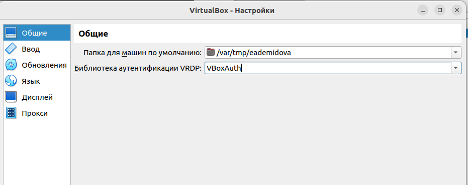{#fig:001 width=70%}

Скачаемаем образ Kali Linux[@kali:bash]. Создадим виртуальную машину. Добавим новый привод оптических дисков и выберите образ операционной системы, укажем имя виртуальной машины, тип операционной системы -- Linux, Debian (64-bit), рамзер основной памяти  -- 2048 МБ,  конфигурацию жёсткого диска — загрузочный, VDI (BirtualBox Disk Image), динамический виртуальный диск,  размер диска — 40 ГБ (или больше), его расположение -- в данном случае /var/tmp/eademidova/eademidova.vdi(рис. @fig:002 - @fig:005).

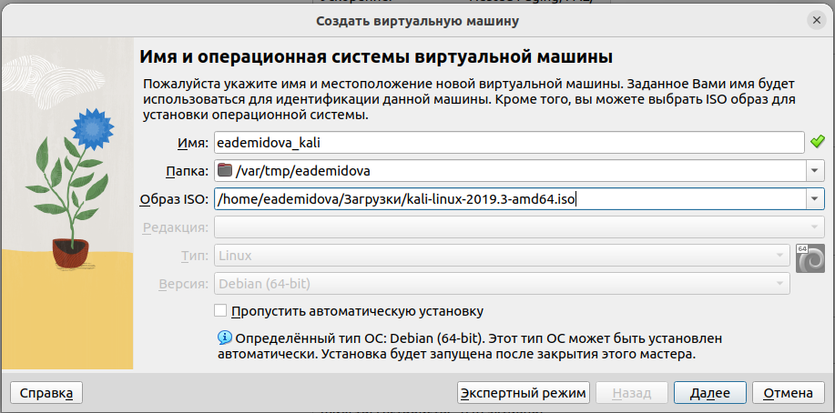{#fig:002 width=70%}

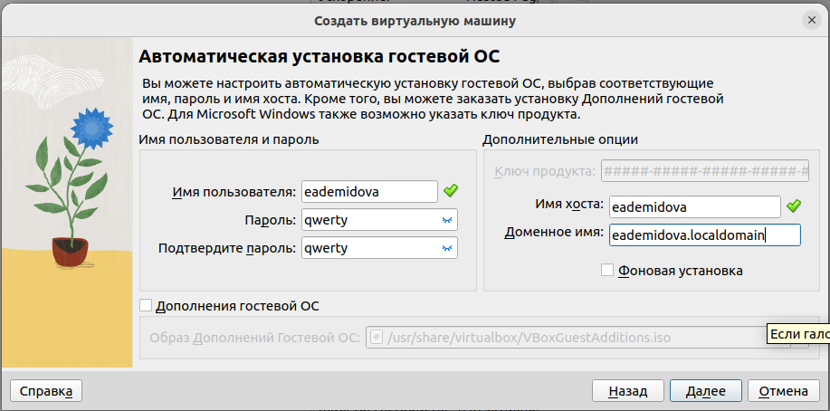{#fig:003 width=70%}

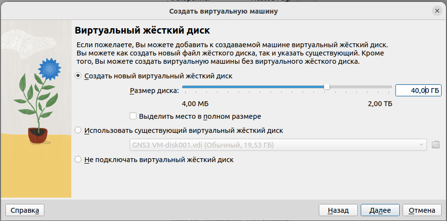{#fig:004 width=70%}

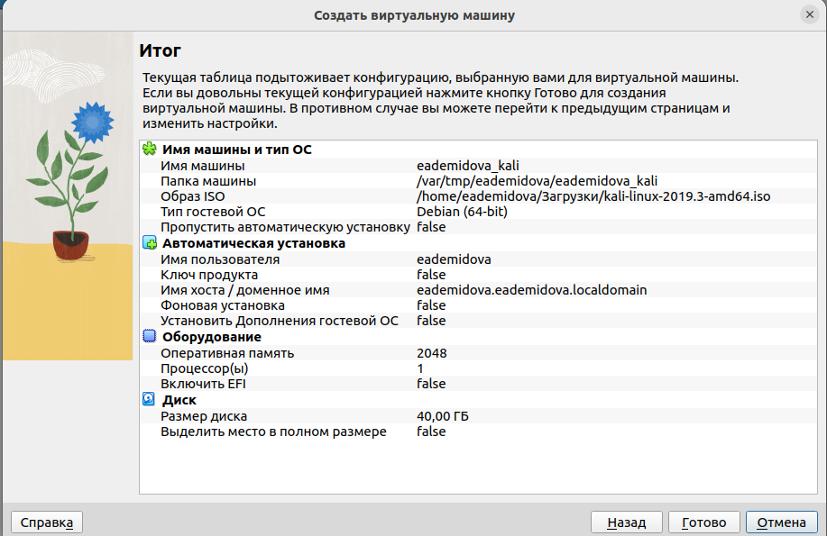{#fig:005 width=70%}

Запустим виртуальную машину, выберем English в качестве языка интерфейса(рис. @fig:006).

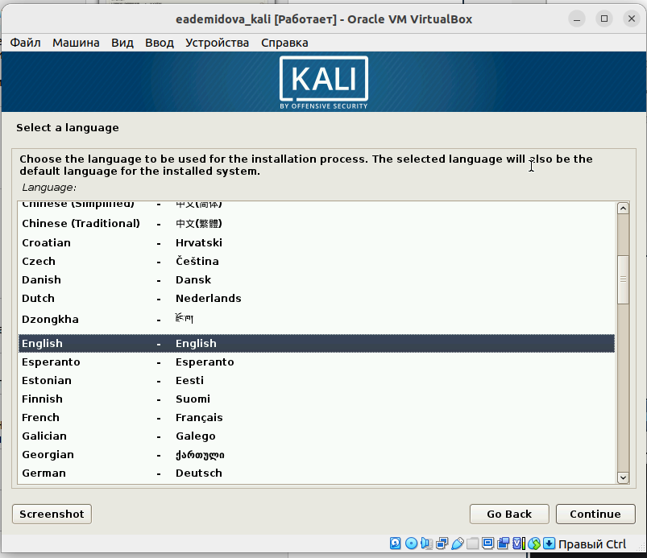{#fig:006 width=70%}

Установим имя хоста, пользователя и пароль суперпользователя(рис. @fig:007 - @fig:009):

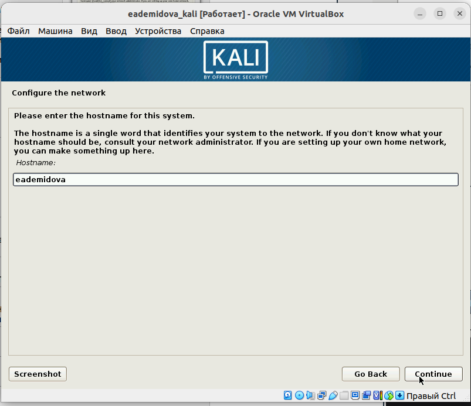{#fig:007 width=70%}

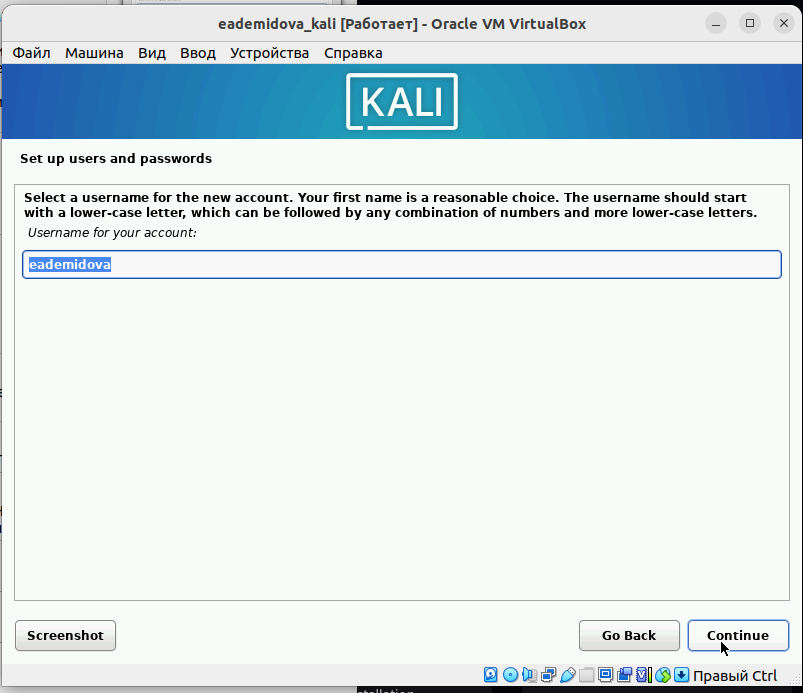{#fig:008 width=70%}

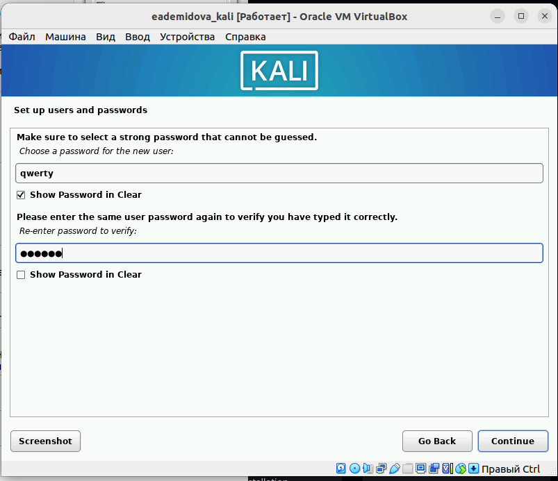{#fig:009 width=70%}

Установим пароль для root и пользователя с правами администратора(рис. @fig:010, @fig:011):

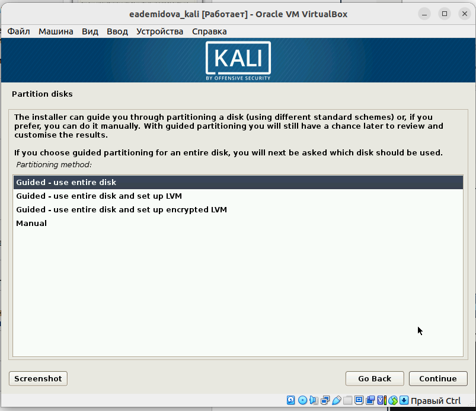{#fig:010 width=70%}

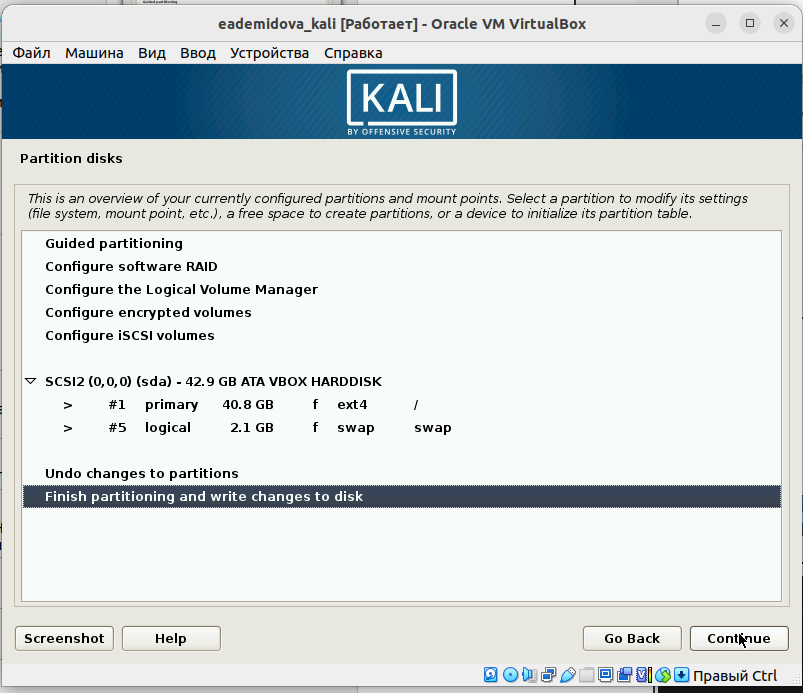{#fig:011 width=70%}

Выберем базовое ПО для начальной установки(рис. @fig:012):

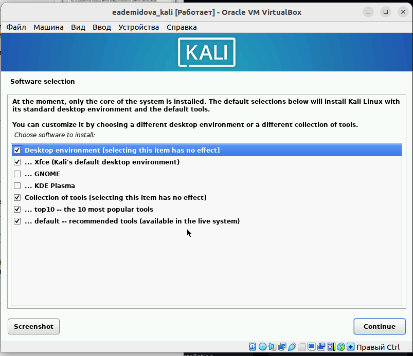{#fig:012 width=70%}

Вход в аккаунт(рис. @fig:013, @fig:013):

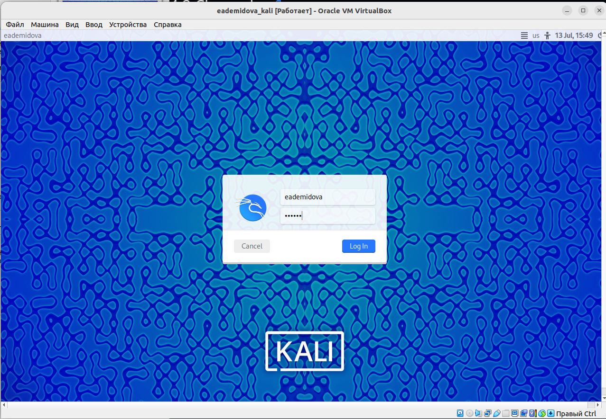{#fig:013 width=70%}

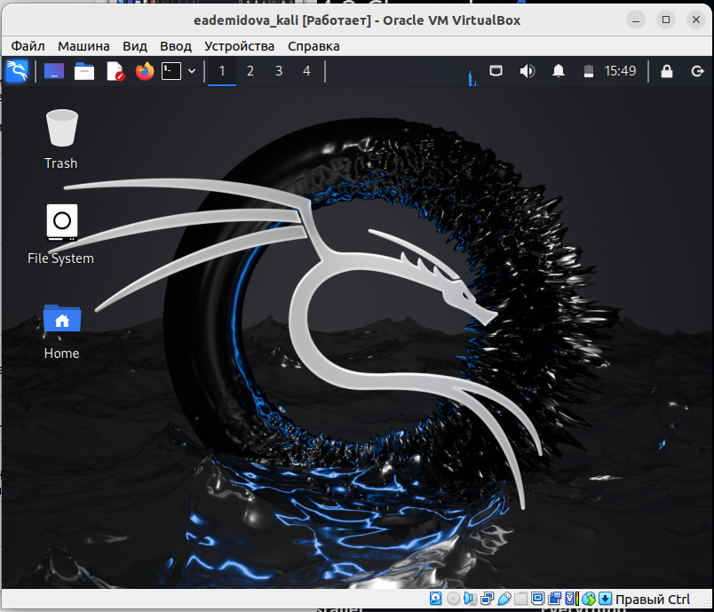{#fig:014 width=70%}

# Выводы

В результате выполнения работы был уавстановлен дистрибутив Kali Linux в виртуальную машину.

# Список литературы{.unnumbered}

::: {#refs}
:::

