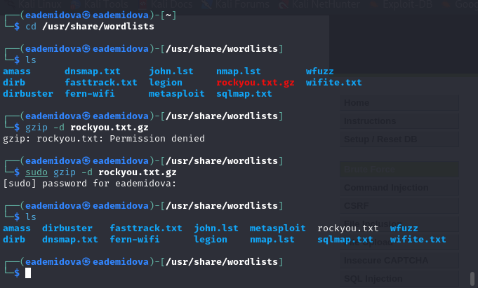
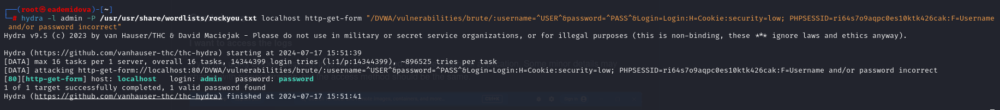
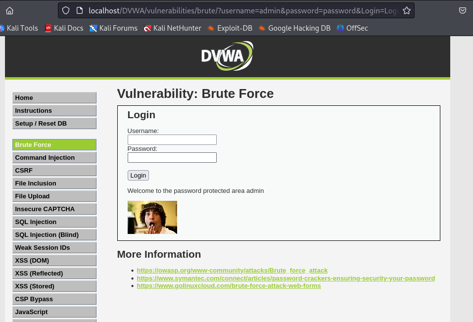

---
## Front matter
lang: ru-RU
title:  Основы информационной безопасности. Индивидуальный проект
subtitle: Этап № 3. Использование Hydra
author: |
	Демидова Е.А.
institute: Российский Университет дружбы народов
date: 09.09.2023

## i18n babel
babel-lang: russian
babel-otherlangs: english

## Formatting pdf
toc: false
toc-title: Содержание
slide_level: 2
aspectratio: 169
section-titles: true
theme: metropolis
header-includes:
 - \metroset{progressbar=frametitle,sectionpage=progressbar,numbering=fraction}
 - '\makeatletter'
 - '\beamer@ignorenonframefalse'
 - '\makeatother'
---

# Информация

## Докладчик

:::::::::::::: {.columns align=center}
::: {.column width="70%"}

  * Демидова Екатерина Алексеевна
  * студентка группы НКНбд-01-21
  * Российский университет дружбы народов
  * <https://github.com/eademidova>

:::
::: {.column width="30%"}

:::
::::::::::::::

# Вводная часть

## Цели и задачи

**Целью** данной работы является является использование Hydra для подбора пароля.

**Задачи:**

- Подобрать пароль с помощью Hydra

**Инструмент:** DVWA, Hydra

# Выполнение лабораторной работы

## Настройка DVWA

{#fig:001 width=50%}

## Просмотр DVWA

{#fig:002 width=50%}

## Файл с паролями

{#fig:003 width=70%}

## Файл с паролями

{#fig:004 width=70%}

## Просмотр DVWA

{#fig:005 width=100%}

## Brute force атака 

{#fig:006 width=100%}

## Brute force атака 

{#fig:007 width=70%}

# Заключение

## Выводы

В результате выполнения работы была использована Hydra для атаки типа brute force.

## Список литературы

1. DVWA [Электронный ресурс]. GitHub, Inc, 2024. URL: https://github.com/digininja/DVWA.
2. Подробное руководство по Hydra [Электронный ресурс]. CISOCLUB, 2024. URL: https://cisoclub.ru/podrobnoe-rukovodstvo-po-hydra/.
