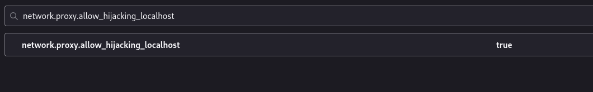

---
## Front matter
lang: ru-RU
title:  Основы информационной безопасности. Индивидуальный проект
subtitle: Этап № 5. Использование Burp Suite
author: |
	Демидова Е.А.
institute: Российский Университет дружбы народов
date: 09.09.2023

## i18n babel
babel-lang: russian
babel-otherlangs: english

## Formatting pdf
toc: false
toc-title: Содержание
slide_level: 2
aspectratio: 169
section-titles: true
theme: metropolis
header-includes:
 - \metroset{progressbar=frametitle,sectionpage=progressbar,numbering=fraction}
 - '\makeatletter'
 - '\beamer@ignorenonframefalse'
 - '\makeatother'
---

# Информация

## Докладчик

:::::::::::::: {.columns align=center}
::: {.column width="70%"}

  * Демидова Екатерина Алексеевна
  * студентка группы НКНбд-01-21
  * Российский университет дружбы народов
  * <https://github.com/eademidova>

:::
::: {.column width="30%"}

:::
::::::::::::::

# Вводная часть

## Цели и задачи

**Целью** данной работы является является использование Burp Suit для перехвата, изменения и изучения HTTP запросов и ответов. 

**Задачи:**

- Перехватить HTTP запрос и ответ
- Проанализировать HTTP запрос и ответ

**Инструмент:** DVWA, Burp Suit

# Выполнение лабораторной работы

## Установка ПО

{#fig:001 width=80%}

## Создание проекта

{#fig:002 width=65%}

## Создание проекта

{#fig:003 width=65%}

## Настройка перехвата трафика

{#fig:004 width=80%}

## Настройка перехвата трафика

{#fig:005 width=60%}

## Настройка перехвата трафика

{#fig:006 width=70%}

## Перехват запросов

{#fig:007 width=70%}

## Перехват запросов

{#fig:008 width=70%}

## Перехват запросов

{#fig:009 width=70%}

## Перехват запросов

{#fig:010 width=70%}

# Заключение

## Выводы

В результате выполнения работы научились на практике использовать ПО Burp Suit для перехвата, изменения и изучения HTTP запросов и ответов. 

## Список литературы

1. DVWA [Электронный ресурс]. GitHub, Inc, 2024. URL: https://github.com/digininja/DVWA.
2. Burp Suit [Электронный ресурс]. PortSwigger Ltd., 2024. URL: https://portswigger.net/burp.